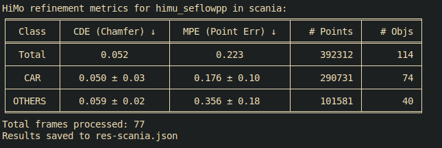

HiMo: High-Speed Objects Motion Compensation in Point Clouds
---

[](https://arxiv.org/abs/2503.00803)
[](https://kin-zhang.github.io/HiMo)
[](https://youtu.be/rofaKfezIx0?si=59mMPLYUMgvrkRGj)
[](https://huggingface.co/datasets/KTH/HiMo)
[](https://www.codabench.org/competitions/12524)


<!-- Note 2025-08-28: I knew sometime we might want to see codes asap, so I upload all my experiment codes without cleaning up (some lib might missing etc).  -->
<!-- I will try my best to cleanup TBD list here: -->

<!-- Update 2025-12-30: I'm back and updating the script now.... Hope I can finish all it before 2026-01-13. -->
Setup Tasks:
- [x] Update the repo README.
- [x] Update [OpenSceneFlow](https://github.com/KTH-RPL/OpenSceneFlow) repo for dataprocess and SeFlow++.
- [x] Test successfully evaluation codes on Scania and Argoverse2.
- [ ] Test successfully visualization codes.
- [x] Upload [Scania validation set (w/o gt)](https://huggingface.co/datasets/KTH/HiMo).
- [x] Setup [leaderboard](https://www.codabench.org/competitions/12524) for users get their Scania val score.
- [x] Downstream task two repos README update.
- [x] Public the [author-response file](https://github.com/KTH-RPL/HiMo/discussions/1) for readers to check some discussion and future directions etc.

## Environment Setup

Clone this repo with submodule:
```bash
git clone --recurse-submodules https://github.com/KTH-RPL/HiMo.git
```

Please refer to [OpenSceneFlow](https://github.com/KTH-RPL/OpenSceneFlow) to setup the `opensf` Python environment or docker pull the opensf image.

## Run HiMo

For HiMo paper (with review discussion), we discussed two possible way to do motion compensation:
1) In our paper, we propose HiMo, a modular pipeline that repurposes scene flow to compute distortion correction vectors for each point.
2) While it is theoretically possible to attempt such correction using alternative approaches (e.g.,dynamic segmentation + ICP alignment across LiDARs), such solutions would require complex ad-hoc heuristics for target selection, tracking, and optimization and have not been shown to work in practice.

We present Our HiMo pipeline **how to use scene flow** for motion compensation here:

### Run Scene Flow

Please refer to [OpenSceneFlow](https://github.com/KTH-RPL/OpenSceneFlow) for output the flow, you can use SeFlow++ or other optimization-based baselines in our paper, we also pushed all baseline code into our codebase.

After training, please run [OpenSceneFlow/save.py] for output the flow results:
```bash
cd OpenSceneFlow
# (feed-forward): load ckpt
python save.py checkpoint=/home/kin/model_zoo/seflowpp_best.ckpt dataset_path=/home/kin/data/scania/val

# (optimization-based): change another model by passing model name.
python save.py model=fastnsf dataset_path=/home/kin/data/av2/h5py/demo/val
```

### Save Motion Compensation

For local validation like in av2, you can directly run [eval.py] as we support read scene flow (HiMo) and then compensated inside eval code, 
check more in [evaluation section](#evaluation).

However, to support further method and eval on the public leaderboard, we provide the [save_zip.py](save_zip.py) script to save compensation distance for each point as .zip file under each scene folder.

```bash
# HiMo (seflow++)
python save_zip.py --data_dir /home/kin/data/scania/val --res_name 'seflowpp_best'
```

For further method, you can refer this script for the same format saving.

## Evaluation

### Scania

First download the Scania validation set from [huggingface](https://huggingface.co/datasets/KTH/HiMo) (~ 2GB) with 10 scenes.
```bash
# setup hf cli if you don't have it
# curl -LsSf https://hf.co/cli/install.sh | bash
hf download KTH/HiMo --repo-type dataset --local-dir /home/kin/data/scania/val
```

Get the result files with HiMo by following the best model we have in the paper, and save the .zip files for afterward online evaluation:
```bash
cd OpenSceneFlow
# (feed-forward): load ckpt
python save.py checkpoint=/home/kin/model_zoo/seflowpp_best.ckpt dataset_path=/home/kin/data/scania/val

cd .. # back to HiMo
python save_zip.py --data_dir /home/kin/data/scania/val --res_name 'seflowpp_best'
```

Then you can submit the generated .zip files to the [HiMo Codabench Leaderboard](https://www.codabench.org/competitions/12524) for evaluation.

Note that for HiMo (SeFlow++) and other methods, the screenshot of Scania leaderboard as shown below, data-driven baselines are self-supervised trained on internal train data and then directly evaluated on Scania val set.



### Argoverse 2

As mentioned in the paper, we select high-speed objects scenes, the evaluated frames is listed in [assets/docs/av2/index_eval.pkl](assets/docs/av2/index_eval.pkl). You can download it and put it under av2 .h5 data folder (13 scenes are provided).

Then run the evaluation code:
```bash
# himo(flow): first run scene flow with flow-mode the motion compensation will be done inside eval code.
# others: save your comp_dis results as .zip file under each scene folder, then run eval code.

python eval.py --data_dir /home/kin/data/av2/h5py/sensor/himo --flow_mode 'seflowpp_best'
```

### Downstream Task

In the paper, we present Segmentation Task: [WaffleIron](https://github.com/Kin-Zhang/WaffleIron/feature/himo) and 
3D Detection Task: [OpenPCDet](https://github.com/Kin-Zhang/OpenPCDet/tree/feature/himo). 
Please refer to the [downstream/README.md](downstream/README.md) for more details.

## Visualization

To visualize the HiMo results, we refer OpenSceneFlow open3d visualizer to do so:
```bash
python visualize.py --flow "['raw', 'seflowpp', 'nsfp']"
```

For paper results, I manually select some instance for a clearer qualitative comparison etc.
```bash
python tools/view_instance.py
```

### Animation

For project website animation, check [tools/animation_video.py](tools/animation_video.py).
```python
# first step:
fire.Fire(save_animation_traj)

# second step:
fire.Fire(animation_video)
```

For Video animation example in Youtube and Presentation, we use [manim](https://www.manim.community/). I uploaded the manim project file under [tools/manim_himo](tools/manim_himo) for readers to check.

## Cite & Acknowledgements

```
@article{zhang2025himo,
  title={{HiMo}: High-Speed Objects Motion Compensation in Point Cloud},
  author={Zhang, Qingwen and Khoche, Ajinkya and Yang, Yi and Ling, Li and Mansouri, Sina Sharif and Andersson, Olov and Jensfelt, Patric},
  journal={IEEE Transactions on Robotics}, 
  year={2025},
  volume={41},
  pages={5896-5911},
  doi={10.1109/TRO.2025.3619042}
}
```

💞 We sincerely thank Bogdan Timus and Magnus Granström (Scania) and Ci Li (KTH RPL) for their contributions to this work. We also appreciate Yixi Cai, Yuxuan Liu, Peizheng Li, and Shenghai Yuan for their insightful discussions, as well as the anonymous reviewers for their valuable feedback.

This work was partially supported by the Wallenberg AI, Autonomous Systems and Software Program (WASP) funded by the Knut and Alice Wallenberg Foundation and Prosense (2020-02963) funded by Vinnova. 
The computations were enabled by the supercomputing resource Berzelius provided by National Supercomputer Centre at Linköping University and the Knut and Alice Wallenberg Foundation, Sweden.
